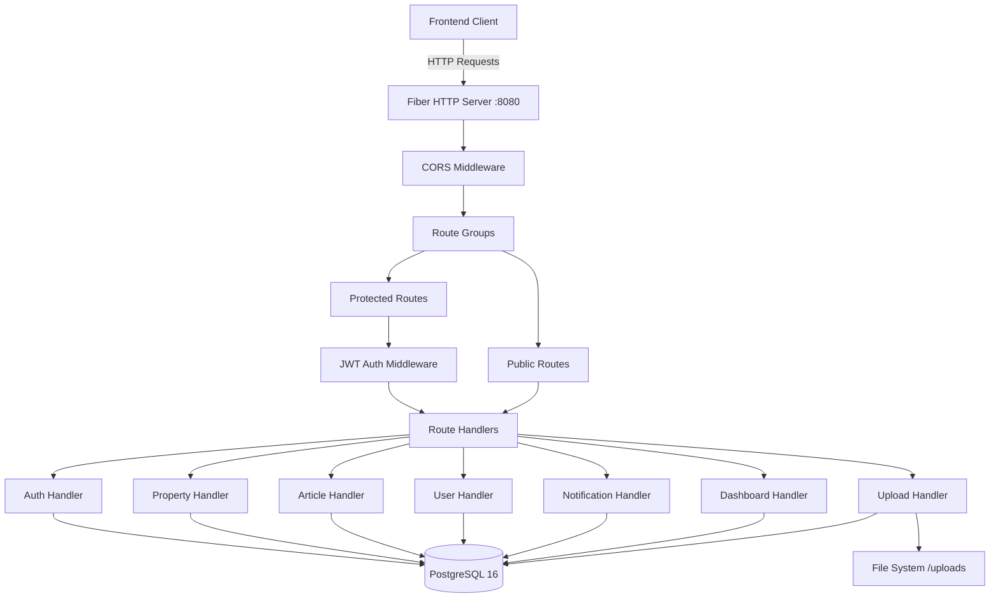
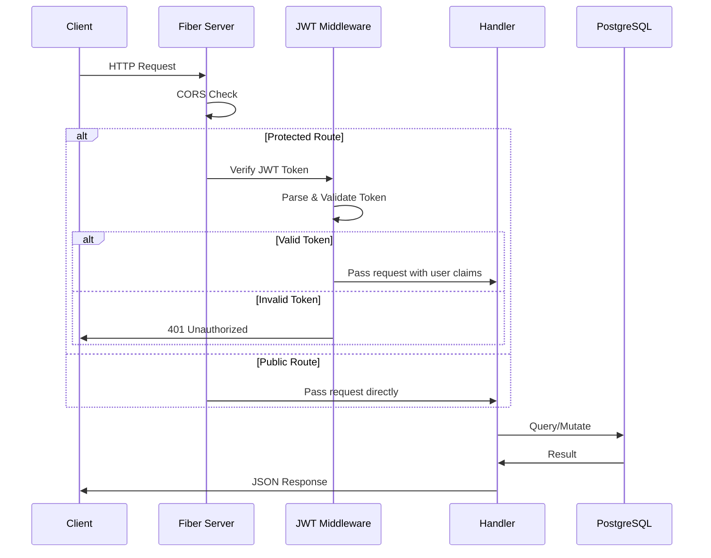
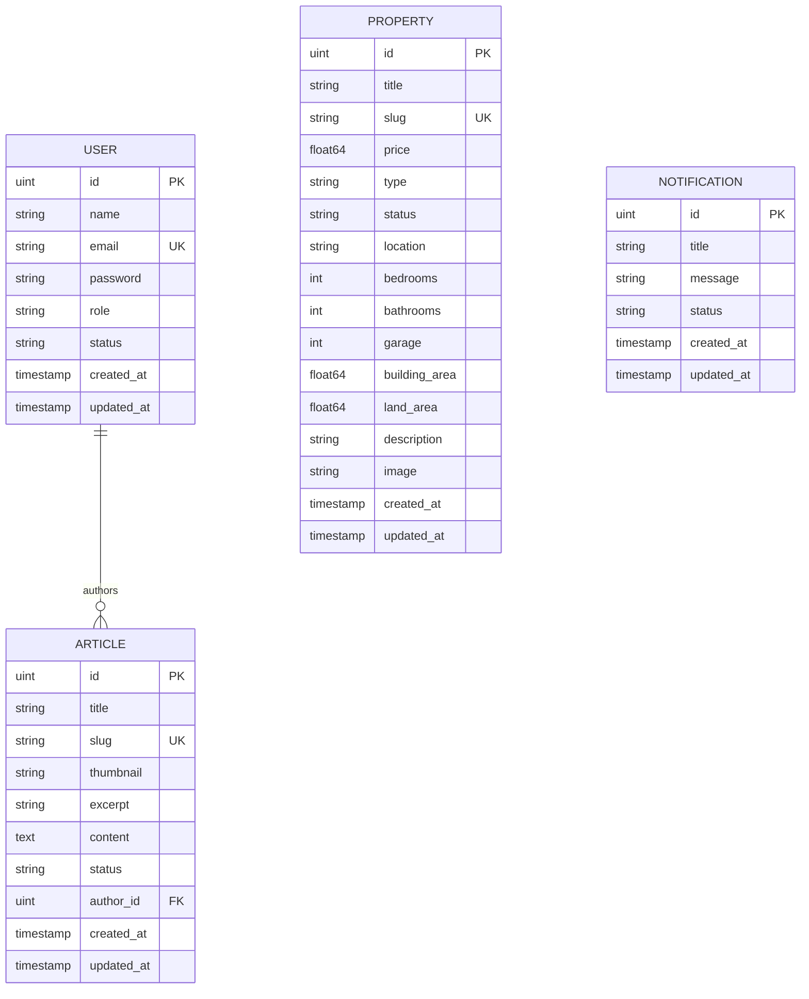

# Design Document: Namura Backend API

## Overview

The Namura Backend API is a RESTful service for a real estate property management system. It provides authentication, CRUD operations for properties, articles, users, and notifications, image upload, and dashboard statistics. The system is built with Go using the Fiber v2 web framework, PostgreSQL 16 as the database (via GORM ORM), and JWT-based authentication.

The API follows a layered architecture pattern separating concerns into configuration, database, models, middleware, handlers, and routes. All protected endpoints require a valid JWT token in the Authorization header.

## Architecture

### High-Level Architecture Diagram



### Package Structure

```
backend/
├── cmd/
│   └── main.go              # Application entry point
├── config/
│   └── config.go            # Environment variable loading & validation
├── database/
│   └── database.go          # PostgreSQL connection & migration
├── models/
│   ├── user.go              # User model
│   ├── property.go          # Property model
│   ├── article.go           # Article model
│   └── notification.go      # Notification model
├── middleware/
│   └── auth.go              # JWT authentication middleware
├── handlers/
│   ├── auth.go              # Login handler
│   ├── property.go          # Property CRUD handlers
│   ├── article.go           # Article CRUD handlers
│   ├── user.go              # User CRUD handlers
│   ├── notification.go      # Notification CRUD handlers
│   ├── dashboard.go         # Dashboard statistics handler
│   └── upload.go            # Image upload handler
├── routes/
│   └── routes.go            # Route registration
└── utils/
    ├── slug.go              # Slug generation utility
    └── validator.go         # Input validation helpers
```

### Request Flow



### Design Decisions

1. **Layered Architecture**: Separating config, database, models, middleware, handlers, and routes ensures each layer has a single responsibility and can be tested independently.
2. **GORM AutoMigrate**: Using GORM's auto-migration on startup keeps the schema in sync with Go structs without requiring a separate migration tool for this project's scope.
3. **Handler-level validation**: Input validation is performed in handlers before database operations to fail fast and return clear error messages.
4. **Slug generation utility**: Centralized slug generation ensures consistent URL-friendly identifiers across properties and articles.
5. **File system storage for uploads**: Images are stored on the local filesystem under `/uploads` for simplicity. The path is stored in the database record.

## Components and Interfaces

### 1. Config Package (`backend/config/`)

```go
// Config holds all environment configuration
type Config struct {
    DBHost    string
    DBPort    string
    DBUser    string
    DBPass    string
    DBName    string
    JWTSecret string
}

// LoadConfig loads and validates environment variables from .env
// Returns error if any required variable is missing or empty
func LoadConfig() (*Config, error)
```

### 2. Database Package (`backend/database/`)

```go
// DB is the global GORM database instance
var DB *gorm.DB

// Connect establishes a PostgreSQL connection with a 30-second timeout
// and runs AutoMigrate for all models
func Connect(cfg *config.Config) error
```

### 3. Models Package (`backend/models/`)

```go
// User represents a system user account
type User struct {
    ID        uint           `gorm:"primaryKey" json:"id"`
    Name      string         `gorm:"size:255;not null" json:"name"`
    Email     string         `gorm:"size:255;uniqueIndex;not null" json:"email"`
    Password  string         `gorm:"not null" json:"-"`
    Role      string         `gorm:"size:50;not null" json:"role"`
    Status    string         `gorm:"size:50;not null" json:"status"`
    CreatedAt time.Time      `json:"created_at"`
    UpdatedAt time.Time      `json:"updated_at"`
}

// Property represents a real estate listing
type Property struct {
    ID           uint      `gorm:"primaryKey" json:"id"`
    Title        string    `gorm:"size:255;not null" json:"title"`
    Slug         string    `gorm:"size:200;uniqueIndex" json:"slug"`
    Price        float64   `gorm:"not null" json:"price"`
    Type         string    `gorm:"size:100;not null" json:"type"`
    Status       string    `gorm:"size:50;not null" json:"status"`
    Location     string    `gorm:"size:255;not null" json:"location"`
    Bedrooms     int       `gorm:"default:0" json:"bedrooms"`
    Bathrooms    int       `gorm:"default:0" json:"bathrooms"`
    Garage       int       `gorm:"default:0" json:"garage"`
    BuildingArea float64   `gorm:"default:0" json:"building_area"`
    LandArea     float64   `gorm:"default:0" json:"land_area"`
    Description  string    `gorm:"size:5000" json:"description"`
    Image        string    `gorm:"size:500" json:"image"`
    CreatedAt    time.Time `json:"created_at"`
    UpdatedAt    time.Time `json:"updated_at"`
}

// Article represents a blog/content entry
type Article struct {
    ID        uint      `gorm:"primaryKey" json:"id"`
    Title     string    `gorm:"size:255;not null" json:"title"`
    Slug      string    `gorm:"size:200;uniqueIndex" json:"slug"`
    Thumbnail string    `gorm:"size:500" json:"thumbnail"`
    Excerpt   string    `gorm:"size:500" json:"excerpt"`
    Content   string    `gorm:"type:text;not null" json:"content"`
    Status    string    `gorm:"size:50;not null" json:"status"`
    AuthorID  uint      `gorm:"not null" json:"author_id"`
    Author    User      `gorm:"foreignKey:AuthorID" json:"author,omitempty"`
    CreatedAt time.Time `json:"created_at"`
    UpdatedAt time.Time `json:"updated_at"`
}

// Notification represents a system notification
type Notification struct {
    ID        uint      `gorm:"primaryKey" json:"id"`
    Title     string    `gorm:"size:255;not null" json:"title"`
    Message   string    `gorm:"size:1000;not null" json:"message"`
    Status    string    `gorm:"size:50;not null" json:"status"`
    CreatedAt time.Time `json:"created_at"`
    UpdatedAt time.Time `json:"updated_at"`
}
```

### 4. Middleware Package (`backend/middleware/`)

```go
// AuthRequired returns a Fiber middleware handler that validates JWT tokens
// It extracts the token from "Authorization: Bearer <token>" header,
// verifies signature and expiration, and stores user claims in Locals
func AuthRequired(jwtSecret string) fiber.Handler
```

### 5. Handlers Package (`backend/handlers/`)

```go
// Auth handlers
func Login(c *fiber.Ctx) error

// Property handlers
func GetProperties(c *fiber.Ctx) error
func GetProperty(c *fiber.Ctx) error
func CreateProperty(c *fiber.Ctx) error
func UpdateProperty(c *fiber.Ctx) error
func DeleteProperty(c *fiber.Ctx) error

// Upload handler
func UploadPropertyImage(c *fiber.Ctx) error

// Article handlers
func GetArticles(c *fiber.Ctx) error
func GetArticle(c *fiber.Ctx) error
func CreateArticle(c *fiber.Ctx) error
func UpdateArticle(c *fiber.Ctx) error
func DeleteArticle(c *fiber.Ctx) error

// User handlers
func GetUsers(c *fiber.Ctx) error
func CreateUser(c *fiber.Ctx) error
func UpdateUser(c *fiber.Ctx) error
func DeleteUser(c *fiber.Ctx) error

// Notification handlers
func GetNotifications(c *fiber.Ctx) error
func CreateNotification(c *fiber.Ctx) error
func DeleteNotification(c *fiber.Ctx) error

// Dashboard handler
func GetDashboardStats(c *fiber.Ctx) error
```

### 6. Routes Package (`backend/routes/`)

```go
// SetupRoutes registers all API routes on the Fiber app
func SetupRoutes(app *fiber.App, jwtSecret string)
```

### 7. Utils Package (`backend/utils/`)

```go
// GenerateSlug converts a title to a URL-friendly slug
// - Converts to lowercase
// - Replaces spaces and special characters with hyphens
// - Removes consecutive hyphens
// - Trims leading/trailing hyphens
// - Truncates to maxLen characters (default 200)
func GenerateSlug(title string, maxLen int) string

// ValidateEmail checks if a string is a valid email format
func ValidateEmail(email string) bool
```

### API Route Map

| Method | Path | Auth | Handler | Description |
|--------|------|------|---------|-------------|
| GET | `/` | No | Health check | Server status |
| POST | `/api/auth/login` | No | Login | User authentication |
| GET | `/api/properties` | Yes | GetProperties | List all properties |
| GET | `/api/properties/:id` | Yes | GetProperty | Get single property |
| POST | `/api/properties` | Yes | CreateProperty | Create property |
| PUT | `/api/properties/:id` | Yes | UpdateProperty | Update property |
| DELETE | `/api/properties/:id` | Yes | DeleteProperty | Delete property |
| POST | `/api/properties/:id/upload` | Yes | UploadPropertyImage | Upload image |
| GET | `/api/articles` | Yes | GetArticles | List all articles |
| GET | `/api/articles/:id` | Yes | GetArticle | Get single article |
| POST | `/api/articles` | Yes | CreateArticle | Create article |
| PUT | `/api/articles/:id` | Yes | UpdateArticle | Update article |
| DELETE | `/api/articles/:id` | Yes | DeleteArticle | Delete article |
| GET | `/api/users` | Yes | GetUsers | List all users |
| POST | `/api/users` | Yes | CreateUser | Create user |
| PUT | `/api/users/:id` | Yes | UpdateUser | Update user |
| DELETE | `/api/users/:id` | Yes | DeleteUser | Delete user |
| GET | `/api/notifications` | Yes | GetNotifications | List notifications |
| POST | `/api/notifications` | Yes | CreateNotification | Create notification |
| DELETE | `/api/notifications/:id` | Yes | DeleteNotification | Delete notification |
| GET | `/api/dashboard/stats` | Yes | GetDashboardStats | Dashboard counts |

## Data Models

### Entity Relationship Diagram



### Database Constraints

- **User.Email**: Unique index, max 255 characters
- **Property.Slug**: Unique index, max 200 characters
- **Property.Description**: Max 5000 characters
- **Article.Slug**: Unique index, max 200 characters
- **Article.AuthorID**: Foreign key referencing User.ID
- **Notification.Title**: Max 255 characters
- **Notification.Message**: Max 1000 characters

### JSON Response Formats

**Login Success Response:**
```json
{
  "token": "eyJhbGciOiJIUzI1NiIs...",
  "user": {
    "id": 1,
    "name": "Admin User"
  }
}
```

**Dashboard Stats Response:**
```json
{
  "total_properties": 42,
  "total_articles": 15,
  "total_users": 5,
  "total_notifications": 8
}
```

**Error Response Format:**
```json
{
  "error": "descriptive error message"
}
```

**Validation Error Response Format:**
```json
{
  "error": "validation failed",
  "details": {
    "field_name": "error description"
  }
}
```


## Correctness Properties

*A property is a characteristic or behavior that should hold true across all valid executions of a system—essentially, a formal statement about what the system should do. Properties serve as the bridge between human-readable specifications and machine-verifiable correctness guarantees.*

### Property 1: Config validation rejects incomplete environment

*For any* subset of the required environment variables (DB_HOST, DB_PORT, DB_USER, DB_PASS, DB_NAME, JWT_SECRET) where at least one variable is missing or empty, the LoadConfig function SHALL return an error indicating the name of the missing variable.

**Validates: Requirements 1.5, 10.2**

### Property 2: Password hashing round-trip

*For any* valid password string (at least 1 character), hashing it with bcrypt SHALL produce a hash that (1) successfully verifies against the original password using bcrypt.CompareHashAndPassword, and (2) has a cost factor of at least 10.

**Validates: Requirements 2.4**

### Property 3: JWT token generation and middleware extraction round-trip

*For any* valid user ID (positive integer) and user name (non-empty string), generating a JWT token and passing it through the authentication middleware SHALL result in the middleware extracting the same user ID and name from the token claims.

**Validates: Requirements 2.5, 3.1**

### Property 4: Invalid tokens are always rejected

*For any* random string that is not a validly-signed JWT token (including empty strings, random bytes, tokens signed with a different secret, and malformed base64), the JWT authentication middleware SHALL reject the request with HTTP status 401.

**Validates: Requirements 3.4**

### Property 5: Invalid credentials produce identical error responses

*For any* login attempt that fails (whether due to non-existent email or incorrect password), the Auth_Service SHALL return the same HTTP status code (401) and the same error message structure, making it impossible to distinguish between the two failure modes from the response alone.

**Validates: Requirements 2.2, 2.3**

### Property 6: Slug generation invariants

*For any* input string (including empty strings, unicode, special characters, and very long strings), the GenerateSlug function SHALL produce a result that satisfies ALL of: (1) contains only lowercase alphanumeric characters and hyphens, (2) contains no consecutive hyphens, (3) has no leading or trailing hyphens, (4) has length ≤ 200 characters.

**Validates: Requirements 4.10, 6.10**

### Property 7: Property validation rejects invalid payloads

*For any* property creation payload where at least one required field (Title, Price, Type, Status, Location) is missing, or where any numeric field (Price, Bedrooms, Bathrooms, Garage, BuildingArea, LandArea) has a negative value, or where Title exceeds 255 characters or Description exceeds 5000 characters, the Property_Service SHALL return HTTP status 400 with a validation error.

**Validates: Requirements 4.5, 4.12**

### Property 8: User validation rejects invalid payloads

*For any* user creation payload where Name is empty or exceeds 255 characters, Email is not a valid email format, or Password is fewer than 8 characters, the User_Service SHALL return HTTP status 400 with a validation error indicating which field failed.

**Validates: Requirements 7.4**

### Property 9: Required field validation for articles and notifications

*For any* article creation payload missing Title, Content, or Status, OR any notification creation payload missing Title, Message, or Status, the respective service SHALL return HTTP status 400 with a validation error indicating the missing fields.

**Validates: Requirements 6.5, 8.3**

### Property 10: Non-allowed image types are rejected

*For any* file upload where the content type is not one of image/jpeg, image/png, or image/webp, the Image_Upload_Service SHALL reject the request with HTTP status 400.

**Validates: Requirements 5.2**

### Property 11: Duplicate slug uniqueness

*For any* sequence of articles created with the same title, each generated slug SHALL be unique within the database (achieved by appending numeric suffixes).

**Validates: Requirements 6.12**

### Property 12: Password field never exposed in user responses

*For any* API response from the User_Service (list users, create user, update user), no user object in the response JSON SHALL contain a "password" field.

**Validates: Requirements 7.1**

### Property 13: Dashboard counts match database state

*For any* database state containing N properties, M articles, P users, and Q notifications, the GET /api/dashboard/stats response SHALL return total_properties=N, total_articles=M, total_users=P, and total_notifications=Q.

**Validates: Requirements 9.1, 9.2**

## Error Handling

### Error Response Strategy

All errors follow a consistent JSON format:

```json
{
  "error": "human-readable error message"
}
```

For validation errors with multiple field failures:

```json
{
  "error": "validation failed",
  "details": {
    "field_name": "specific error for this field"
  }
}
```

### Error Categories

| Category | HTTP Status | When |
|----------|-------------|------|
| Validation Error | 400 | Missing/invalid fields, file type/size violations |
| Authentication Error | 401 | Missing/invalid/expired JWT token |
| Conflict Error | 409 | Duplicate email on user creation/update |
| Not Found | 404 | Resource ID doesn't exist |
| Server Error | 500 | Database failures, file system errors |

### Startup Error Handling

- Missing environment variables → log error with variable name, exit code 1
- Database connection failure → log error with cause, exit code 1
- Database migration failure → log error with migration step, exit code 1

### Runtime Error Handling

- **Database query failures**: Return 500 with generic "internal server error" message. Log detailed error server-side.
- **File system failures** (upload): Return 500 with "server storage failure" message.
- **JWT parsing failures**: Return 401 with appropriate message (expired, invalid, missing).
- **Request body parsing failures**: Return 400 with "invalid request body" message.

### Security Considerations

- Never expose password hashes in API responses (use `json:"-"` tag)
- Never reveal whether email or password was wrong during login (use identical error messages)
- Validate JWT signature before trusting any claims
- Sanitize file names before saving uploads to prevent path traversal
- Limit file upload size at the handler level (10 MB max)

## Testing Strategy

### Testing Framework

- **Unit tests**: Go's built-in `testing` package with `net/http/httptest`
- **Property-based tests**: `github.com/leanovate/gopter` (Go property testing library)
- **Test database**: Use a separate PostgreSQL database or SQLite in-memory for integration tests

### Test Categories

#### 1. Unit Tests (Example-Based)

Focus on specific scenarios and edge cases:

- Login with valid credentials returns token
- Login with non-existent email returns 401
- Login with wrong password returns 401
- CRUD operations for each entity (create, read, update, delete)
- 404 responses for non-existent IDs
- 409 responses for duplicate emails
- File upload with valid image succeeds
- File upload without file returns 400
- Dashboard stats returns correct structure
- Health check endpoint returns 200

#### 2. Property-Based Tests

Each property test runs a minimum of 100 iterations with randomly generated inputs:

- **Feature: namura-backend-api, Property 1**: Config validation with random env var subsets
- **Feature: namura-backend-api, Property 2**: Password hashing round-trip with random passwords
- **Feature: namura-backend-api, Property 3**: JWT round-trip with random user claims
- **Feature: namura-backend-api, Property 4**: Random invalid tokens rejected by middleware
- **Feature: namura-backend-api, Property 5**: Invalid credentials produce identical responses
- **Feature: namura-backend-api, Property 6**: Slug generation invariants with random strings
- **Feature: namura-backend-api, Property 7**: Property validation with random invalid payloads
- **Feature: namura-backend-api, Property 8**: User validation with random invalid payloads
- **Feature: namura-backend-api, Property 9**: Article/notification required field validation
- **Feature: namura-backend-api, Property 10**: Random file types rejected if not in allowed set
- **Feature: namura-backend-api, Property 11**: Duplicate slug uniqueness with repeated titles
- **Feature: namura-backend-api, Property 12**: Password never in user API responses
- **Feature: namura-backend-api, Property 13**: Dashboard counts match seeded DB state

#### 3. Integration Tests

- Database connection and migration on startup
- Full request flow through Fiber app (HTTP → middleware → handler → DB → response)
- File upload saves to filesystem correctly
- CORS headers present in responses

### Test Organization

```
backend/
├── config/
│   └── config_test.go         # Property 1 + unit tests
├── middleware/
│   └── auth_test.go           # Properties 3, 4 + unit tests
├── handlers/
│   ├── auth_test.go           # Property 5 + login unit tests
│   ├── property_test.go       # Property 7 + CRUD unit tests
│   ├── article_test.go        # Property 9 (articles) + CRUD unit tests
│   ├── user_test.go           # Properties 8, 12 + CRUD unit tests
│   ├── notification_test.go   # Property 9 (notifications) + CRUD unit tests
│   ├── dashboard_test.go      # Property 13 + unit tests
│   └── upload_test.go         # Property 10 + unit tests
├── utils/
│   └── slug_test.go           # Property 6 + unit tests
└── integration/
    └── integration_test.go    # Full flow integration tests
```

### Property Test Configuration

```go
// Example property test setup with gopter
properties := gopter.NewProperties(gopter.DefaultTestParametersWithSeed(0))
properties.Property("slug invariants", prop.ForAll(
    func(title string) bool {
        slug := utils.GenerateSlug(title, 200)
        // verify all invariants
        return isLowercase(slug) && noConsecutiveHyphens(slug) && 
               noLeadingTrailingHyphens(slug) && len(slug) <= 200
    },
    gen.AnyString(),
))
properties.TestingRun(t)
```

Each property test MUST:
- Run minimum 100 iterations
- Reference its design document property in a comment
- Use the tag format: `// Feature: namura-backend-api, Property N: <property text>`
